I have a complete picture of both sides now. Let me compile the full analysis.

---

## Backend Audit + Frontend-Backend Integration Plan

### Backend State Summary

The backend is structured around 6 Django apps (`users`, `profiles`, `ingredients`, `recipes`, `social`, `nutrition`) with all API logic centralized in the `api/` app. Here's what's healthy, what's broken, and what's missing:

**What's working:**
- Auth flow: register, login, logout, `me`, token refresh, password reset/change
- User CRUD (`UserViewSet`)
- Profile read/write (`UserProfileViewSet` incl. `me` action)
- Recipe creation (`RecipeCreateView`)
- Cookbooks CRUD + add/remove recipe
- Tried recipes + most-tried aggregation
- Recipe likes CRUD

**Backend issues that must be fixed before connecting:**

| Issue | File | Detail |
|---|---|---|
| `IngredientsViewSet` not routed | `api/urls.py` | Exists in `views/ingredients.py` but never wired |
| `RecipeNutritionView` has logic bugs | `api/views/nutrition.py` | Uses `recipe=self`, `ingredient.ingredient` (nonexistent field), wrong dict keying |
| `RecipeReview` serializers missing `Meta` | `api/serializers/social.py` | `RecipeReviewWriteSerializer` / `RecipeReviewReadSerializer` — will crash |
| Social views (`UserFollow`, `UserBlock`) not routed | `api/urls.py` | Serializers exist, no ViewSets/routes |
| `social.py` stub broken | `api/views/social.py` | Wrong import path, class body unfinished |
| `HealthView` missing `AllowAny` | `api/views/health.py` | Inherits global `IsAuthenticated` — `/api/health/` requires auth |
| No `GET /api/recipes/` list/detail endpoint | — | Only `POST /api/recipes/create/` exists; frontend recipe feed has nothing to call |
| `nutrition` app not in `INSTALLED_APPS` | `server/settings.py` | App exists but is excluded |
| `App.tsx` is dead code | `frontend/src/App.tsx` | Not imported by `main.tsx` |

---

### What's Already Connected (Frontend → Backend)

These `api.ts` calls have working backend routes:

| Frontend call | Backend endpoint |
|---|---|
| `login()` | `POST /api/auth/login/` |
| `register()` | `POST /api/auth/register/` |
| `logout()` | `POST /api/auth/logout/` |
| `getCurrentUser()` | `GET /api/auth/me/` |
| `updateUser(publicId)` | `PATCH /api/users/{public_id}/` |
| `updateUserProfile()` | `PATCH /api/user-profiles/me/` |
| `requestPasswordReset()` | `POST /api/auth/password-reset-request/` |
| `changePassword()` | `POST /api/auth/password-change/` |
| `confirmPasswordReset()` | `POST /api/auth/password-reset-confirm/` |
| `refreshToken()` | `POST /api/auth/token-refresh/` *(defined but never called in the app)* |

---

### What Needs to Be Connected

Here is the full todo list, grouped by priority:

---

#### Group 1 — Backend fixes required before any new connections

1. **Add `AllowAny` to `HealthView`** — currently requires auth, which would break a frontend health check
2. **Wire `IngredientsViewSet`** to `api/urls.py` — the frontend calls `/api/foods/` but the backend has no route; decide: either route under `/api/ingredients/` and update the frontend `getFoods()` URL, or alias `/api/foods/`
3. **Fix `RecipeNutritionView`** — repair the `recipe=self` bug, the wrong `ingredient.ingredient` field lookup, and add it to `api/urls.py`
4. **Fix `RecipeReview` serializers** — add `Meta` class with `model` and `fields` to both `RecipeReviewWriteSerializer` and `RecipeReviewReadSerializer`
5. **Add `GET /api/recipes/` list + detail endpoints** — `RecipeCreateView` only handles creation; the recipe feed, cookbook views, and recipe cards all need a way to fetch recipes
6. **Wire social routes** (`UserFollow`, `UserBlock`) — serializers exist, but no ViewSet or URL route exists for follow/unfollow or block/unblock
7. **Add `nutrition` to `INSTALLED_APPS`** in `settings.py`

---

#### Group 2 — Frontend providers to migrate from localStorage → backend

Currently 5 React context providers store all their state in `localStorage`. Each needs to be wired to the real API:

| Provider file | Currently using | Should call |
|---|---|---|
| `useCookbooks.tsx` | `localStorage` | `GET/POST /api/cookbooks/`, `POST /api/cookbooks/{id}/add-recipe/`, `DELETE /api/cookbooks/{id}/remove-recipe/` |
| `useRecipeActions.tsx` | `localStorage` | `GET/POST/DELETE /api/recipe-likes/`, `GET/POST /api/tried-recipes/` |
| `useSocialActions.tsx` | `localStorage` | Follows/blocks routes (need Group 1 item 6 first) |
| `useUserPreferences.tsx` | `localStorage` | `GET/PATCH /api/user-profiles/me/` for `diet_type`, `daily_calorie_goal`, etc. |
| `useMealPlanning.tsx` | `localStorage` | No backend endpoint exists — needs a new backend model + API |

---

#### Group 3 — Pages with no backend connection

| Page | Currently | Needs |
|---|---|---|
| `RecipeFeedPage.tsx` | Mock data | `GET /api/recipes/` list (Group 1 item 5) |
| `CookbooksPage.tsx` / `CookbookViewPage.tsx` | `localStorage` via `useCookbooks` | `GET /api/cookbooks/` (Group 2) |
| `FavoritesPage.tsx` / `my-recipes` | Mock/localStorage | `GET /api/recipe-likes/`, `GET /api/tried-recipes/` (Group 2) |
| `NutritionPage.tsx` | Unknown/mock | `GET /api/nutrition/` or per-recipe nutrition (Group 1 item 3) |
| `HomePage.tsx` | Unknown | Likely needs recipe + user data — audit needed |

---

#### Group 4 — API client improvements

1. **`refreshToken()` is never called** — needs to be wired into `authenticatedFetch` (auto-retry on 401) or called on app init
2. **`getFoods()` URL mismatch** — calls `/api/foods/` but backend routes as `/api/ingredients/` — one side needs to change
3. **Add `VITE_API_URL` type declaration** to `frontend/src/vite-env.d.ts`
4. **`App.tsx` is dead code** — either wire it in or delete it

---

#### Group 5 — New backend features with no existing implementation

These are frontend pages/features that have **no corresponding backend** at all:

| Feature | Frontend | Backend needed |
|---|---|---|
| Meal planning | `MealPlanningPage.tsx`, `useMealPlanning.tsx` | New model + serializer + API (e.g. `MealPlan`, `MealPlanEntry`) |
| Recipe search/filter | `RecipeFeedPage.tsx` has filter UI | Backend `GET /api/recipes/` needs `?search=`, `?cuisine_type=`, `?dietary_tags=` query params |
| Social feed / follows | `useSocialActions.tsx` | `POST/DELETE /api/follows/`, `POST/DELETE /api/blocks/` routes (Group 1 item 6) |
| User profile picture upload | `AccountPage.tsx` | `UserProfile.profile_picture` is a `URLField` — needs either a file upload endpoint or a URL input flow |

---

### Architecture Overview

```mermaid
flowchart TD
    subgraph frontend [Frontend - React + Vite]
        AuthPage
        AccountPage
        RecipeFeedPage
        CookbooksPage
        FavoritesPage
        NutritionPage
        MealPlanningPage
        apiTs["api.ts (fetch + Token auth)"]
        useCookbooks
        useRecipeActions
        useSocialActions
        useUserPreferences
        useMealPlanning
    end

    subgraph backend [Backend - Django REST Framework]
        authRoutes["Auth routes\n/api/auth/*"]
        userRoutes["User routes\n/api/users/*"]
        profileRoutes["Profile routes\n/api/user-profiles/*"]
        recipeRoutes["Recipe routes\n/api/recipes/*"]
        cookbookRoutes["Cookbook routes\n/api/cookbooks/*"]
        likeRoutes["Like routes\n/api/recipe-likes/*"]
        triedRoutes["Tried routes\n/api/tried-recipes/*"]
        ingredientRoutes["Ingredient routes\n(NOT YET ROUTED)"]
        nutritionRoutes["Nutrition routes\n(BUGGY, NOT ROUTED)"]
        socialRoutes["Social routes\n(NOT YET ROUTED)"]
        mealRoutes["Meal planning routes\n(DOES NOT EXIST)"]
    end

    AuthPage -->|"connected"| apiTs
    AccountPage -->|"connected"| apiTs
    apiTs -->|"connected"| authRoutes
    apiTs -->|"connected"| userRoutes
    apiTs -->|"connected"| profileRoutes

    useCookbooks -->|"localStorage only"| cookbookRoutes
    useRecipeActions -->|"localStorage only"| likeRoutes
    useRecipeActions -->|"localStorage only"| triedRoutes
    useSocialActions -->|"localStorage only"| socialRoutes
    useUserPreferences -->|"localStorage only"| profileRoutes
    useMealPlanning -->|"localStorage only"| mealRoutes
    RecipeFeedPage -->|"mock data only"| recipeRoutes
    NutritionPage -->|"not connected"| nutritionRoutes
    apiTs -->|"URL mismatch /api/foods/"| ingredientRoutes
```

---

This gives us a clear, prioritized roadmap. Groups 1 and 2 are the most impactful since Group 1 unblocks everything else and Group 2 removes all the `localStorage` workarounds. Want to confirm this plan and start on a specific group, or adjust priorities?