I have a complete picture of both sides now. Let me compile the full analysis.

---

## Backend Audit + Frontend-Backend Integration Plan

### Backend State Summary

The backend is structured around 6 Django apps (`users`, `profiles`, `ingredients`, `recipes`, `social`, `nutrition`) with all API logic centralized in the `api/` app. Here's what's healthy, what's broken, and what's missing:

**What's working:**
- Auth flow: register, login, logout, `me`, token refresh, password reset/change
- User CRUD (`UserViewSet`)
- Profile read/write (`UserProfileViewSet` incl. `me` action)
- Recipe creation (`RecipeCreateView`)
- Cookbooks CRUD + add/remove recipe
- Tried recipes + most-tried aggregation
- Recipe likes CRUD

**Backend issues that must be fixed before connecting:**

| Issue | File | Detail |
|---|---|---|
| `IngredientsViewSet` not routed | `api/urls.py` | Exists in `views/ingredients.py` but never wired |
| `RecipeNutritionView` has logic bugs | `api/views/nutrition.py` | Uses `recipe=self`, `ingredient.ingredient` (nonexistent field), wrong dict keying |
| `RecipeReview` serializers missing `Meta` | `api/serializers/social.py` | `RecipeReviewWriteSerializer` / `RecipeReviewReadSerializer` — will crash |
| Social views (`UserFollow`, `UserBlock`) not routed | `api/urls.py` | Serializers exist, no ViewSets/routes |
| `social.py` stub broken | `api/views/social.py` | Wrong import path, class body unfinished |
| `HealthView` missing `AllowAny` | `api/views/health.py` | Inherits global `IsAuthenticated` — `/api/health/` requires auth |
| No `GET /api/recipes/` list/detail endpoint | — | Only `POST /api/recipes/create/` exists; frontend recipe feed has nothing to call |
| `nutrition` app not in `INSTALLED_APPS` | `server/settings.py` | App exists but is excluded |
| `App.tsx` is dead code | `frontend/src/App.tsx` | Not imported by `main.tsx` |

---

### What's Already Connected (Frontend → Backend)

These `api.ts` calls have working backend routes:

| Frontend call | Backend endpoint |
|---|---|
| `login()` | `POST /api/auth/login/` |
| `register()` | `POST /api/auth/register/` |
| `logout()` | `POST /api/auth/logout/` |
| `getCurrentUser()` | `GET /api/auth/me/` |
| `updateUser(publicId)` | `PATCH /api/users/{public_id}/` |
| `updateUserProfile()` | `PATCH /api/user-profiles/me/` |
| `requestPasswordReset()` | `POST /api/auth/password-reset-request/` |
| `changePassword()` | `POST /api/auth/password-change/` |
| `confirmPasswordReset()` | `POST /api/auth/password-reset-confirm/` |
| `refreshToken()` | `POST /api/auth/token-refresh/` *(defined but never called in the app)* |

---

### What Needs to Be Connected

Here is the full todo list, grouped by priority:

---

#### Group 1 — Backend fixes required before any new connections

1. **Add `AllowAny` to `HealthView`** — currently requires auth, which would break a frontend health check
2. **Wire `IngredientsViewSet`** to `api/urls.py` — the frontend calls `/api/foods/` but the backend has no route; decide: either route under `/api/ingredients/` and update the frontend `getFoods()` URL, or alias `/api/foods/`
3. **Fix `RecipeNutritionView`** — repair the `recipe=self` bug, the wrong `ingredient.ingredient` field lookup, and add it to `api/urls.py`
4. **Fix `RecipeReview` serializers** — add `Meta` class with `model` and `fields` to both `RecipeReviewWriteSerializer` and `RecipeReviewReadSerializer`
5. **Add `GET /api/recipes/` list + detail endpoints** — `RecipeCreateView` only handles creation; the recipe feed, cookbook views, and recipe cards all need a way to fetch recipes
6. **Wire social routes** (`UserFollow`, `UserBlock`) — serializers exist, but no ViewSet or URL route exists for follow/unfollow or block/unblock
7. **Add `nutrition` to `INSTALLED_APPS`** in `settings.py`

---

#### Group 2 — Frontend providers to migrate from localStorage → backend

Currently 5 React context providers store all their state in `localStorage`. Each needs to be wired to the real API:

| Provider file | Currently using | Should call |
|---|---|---|
| `useCookbooks.tsx` | `localStorage` | `GET/POST /api/cookbooks/`, `POST /api/cookbooks/{id}/add-recipe/`, `DELETE /api/cookbooks/{id}/remove-recipe/` |
| `useRecipeActions.tsx` | `localStorage` | `GET/POST/DELETE /api/recipe-likes/`, `GET/POST /api/tried-recipes/` |
| `useSocialActions.tsx` | `localStorage` | Follows/blocks routes (need Group 1 item 6 first) |
| `useUserPreferences.tsx` | `localStorage` | `GET/PATCH /api/user-profiles/me/` for `diet_type`, `daily_calorie_goal`, etc. |
| `useMealPlanning.tsx` | `localStorage` | No backend endpoint exists — needs a new backend model + API |

---

#### Group 3 — Pages with no backend connection

| Page | Currently | Needs |
|---|---|---|
| `RecipeFeedPage.tsx` | Mock data | `GET /api/recipes/` list (Group 1 item 5) |
| `CookbooksPage.tsx` / `CookbookViewPage.tsx` | `localStorage` via `useCookbooks` | `GET /api/cookbooks/` (Group 2) |
| `FavoritesPage.tsx` / `my-recipes` | Mock/localStorage | `GET /api/recipe-likes/`, `GET /api/tried-recipes/` (Group 2) |
| `NutritionPage.tsx` | Unknown/mock | `GET /api/nutrition/` or per-recipe nutrition (Group 1 item 3) |
| `HomePage.tsx` | Unknown | Likely needs recipe + user data — audit needed |

---

#### Group 4 — API client improvements

1. **`refreshToken()` is never called** — needs to be wired into `authenticatedFetch` (auto-retry on 401) or called on app init
2. **`getFoods()` URL mismatch** — calls `/api/foods/` but backend routes as `/api/ingredients/` — one side needs to change
3. **Add `VITE_API_URL` type declaration** to `frontend/src/vite-env.d.ts`
4. **`App.tsx` is dead code** — either wire it in or delete it

---

#### Group 5 — New backend features with no existing implementation

These are frontend pages/features that have **no corresponding backend** at all:

| Feature | Frontend | Backend needed |
|---|---|---|
| Meal planning | `MealPlanningPage.tsx`, `useMealPlanning.tsx` | New model + serializer + API (e.g. `MealPlan`, `MealPlanEntry`) |
| Recipe search/filter | `RecipeFeedPage.tsx` has filter UI | Backend `GET /api/recipes/` needs `?search=`, `?cuisine_type=`, `?dietary_tags=` query params |
| Social feed / follows | `useSocialActions.tsx` | `POST/DELETE /api/follows/`, `POST/DELETE /api/blocks/` routes (Group 1 item 6) |
| User profile picture upload | `AccountPage.tsx` | `UserProfile.profile_picture` is a `URLField` — needs either a file upload endpoint or a URL input flow |

---

### Architecture Overview

```mermaid
flowchart TD
    subgraph frontend [Frontend - React + Vite]
        AuthPage
        AccountPage
        RecipeFeedPage
        CookbooksPage
        FavoritesPage
        NutritionPage
        MealPlanningPage
        apiTs["api.ts (fetch + Token auth)"]
        useCookbooks
        useRecipeActions
        useSocialActions
        useUserPreferences
        useMealPlanning
    end

    subgraph backend [Backend - Django REST Framework]
        authRoutes["Auth routes\n/api/auth/*"]
        userRoutes["User routes\n/api/users/*"]
        profileRoutes["Profile routes\n/api/user-profiles/*"]
        recipeRoutes["Recipe routes\n/api/recipes/*"]
        cookbookRoutes["Cookbook routes\n/api/cookbooks/*"]
        likeRoutes["Like routes\n/api/recipe-likes/*"]
        triedRoutes["Tried routes\n/api/tried-recipes/*"]
        ingredientRoutes["Ingredient routes\n(NOT YET ROUTED)"]
        nutritionRoutes["Nutrition routes\n(BUGGY, NOT ROUTED)"]
        socialRoutes["Social routes\n(NOT YET ROUTED)"]
        mealRoutes["Meal planning routes\n(DOES NOT EXIST)"]
    end

    AuthPage -->|"connected"| apiTs
    AccountPage -->|"connected"| apiTs
    apiTs -->|"connected"| authRoutes
    apiTs -->|"connected"| userRoutes
    apiTs -->|"connected"| profileRoutes

    useCookbooks -->|"localStorage only"| cookbookRoutes
    useRecipeActions -->|"localStorage only"| likeRoutes
    useRecipeActions -->|"localStorage only"| triedRoutes
    useSocialActions -->|"localStorage only"| socialRoutes
    useUserPreferences -->|"localStorage only"| profileRoutes
    useMealPlanning -->|"localStorage only"| mealRoutes
    RecipeFeedPage -->|"mock data only"| recipeRoutes
    NutritionPage -->|"not connected"| nutritionRoutes
    apiTs -->|"URL mismatch /api/foods/"| ingredientRoutes
```

---

This gives us a clear, prioritized roadmap. Groups 1 and 2 are the most impactful since Group 1 unblocks everything else and Group 2 removes all the `localStorage` workarounds. Want to confirm this plan and start on a specific group, or adjust priorities?

Group 3 Planning Scan — Pages with No Backend Connection
The Core Challenge: Frontend Recipe vs Backend ApiRecipe
Before connecting any page, a shape mapping layer is needed. The two types diverge in almost every field:

Frontend Recipe	Backend ApiRecipe	Gap
id: string ("1")	id: number (1)	Convert
title: string	name: string	Rename
image: string	— (no field)	Default '' (ImageWithFallback handles empty)
cookTime: number	instructions[].estimated_cooktime (per-step, nullable)	Sum steps or default 0
servings: number	— (no field)	Default 0
difficulty: 'Easy'|'Medium'|'Hard'	— (no field)	Default 'Easy'
ingredients: string[]	[{ ingredient: {name}, quantity, unit }]	Format as "qty unit name"
instructions: string[]	[{ step_number, text }]	Sort by step, map to .text
cuisine?: string	cuisine_type: string	Rename
dietaryTags: string[]	dietary_tags: string[]	Rename
rating?: number	— (no field)	Omit
calories?: number	— (no field)	Omit
A single mapper function apiRecipeToRecipe(r: ApiRecipe): Recipe in api.ts covers this for every page.

What the Backend Already Provides
Endpoint	Status
GET /api/recipes/	Ready — list, auth required, ?search=name/cuisine_type, ?ordering=name/-date_created, no pagination
GET /api/recipes/<id>/	Ready — full detail with nested ingredients + instructions
GET /api/recipes/<id>/nutrition/	Ready — returns {calories, protein, carbs, fat, fiber, sugar, sodium} as decimal strings
POST /api/recipes/create/	Ready — requires structured {name, description, cuisine_type, dietary_tags, ingredients:[{ingredient_id, quantity, unit}], instructions:[{step_number, text}]}
Group 3 — What Needs to Be Connected
Item 1 — api.ts: Add getRecipes(), getRecipe(id), and the mapper
Add two new fetch functions and the apiRecipeToRecipe mapper that all pages will share.

getRecipes(params?) → GET /api/recipes/?search=&ordering= getRecipe(id) → GET /api/recipes/<id>/ apiRecipeToRecipe(r: ApiRecipe): Recipe — the shape bridge

Item 2 — New useRecipes.tsx hook/provider
Replace all import { mockRecipes } from '../data/mockRecipes' references with a shared context so the list is only fetched once, not per-page. It fetches GET /api/recipes/ on mount and provides:

{
  recipes: Recipe[],
  isLoading: boolean,
  error: string | null,
  getRecipeById: (id: string) => Recipe | undefined,
  refetch: () => void,
}
Wrap in main.tsx (inside RecipeActionsProvider since it reads favorites).

Item 3 — HomePage.tsx
Currently: mockRecipes filtered in memory. After: useRecipes().recipes + the same search/filter logic already in the component.

The dietary filter logic in HomePage uses tag matching like "Vegetarian", "Vegan" etc. — these work unchanged since the backend dietary_tags array stores the same string values.

Item 4 — RecipeFeedPage.tsx
Currently: mockRecipes + mockReviews + inline mockRecipeOwners. After:

Replace mockRecipes with useRecipes().recipes
creator field from backend serializer (username string) replaces mockRecipeOwners lookup
Reviews stay mock for now — the backend has RecipeReview model and serializers but no routed ViewSet. Connecting reviews is a separate task (Group 4/later).
Item 5 — FavoritesPage.tsx
Currently: [...mockRecipes, ...myRecipes] filtered by favoriteRecipes and triedRecipes sets. After:

Replace the mockRecipes half with useRecipes().recipes — the sets of liked/tried recipe IDs from the backend already use numeric-string IDs ("1", "2") that match ApiRecipe.id converted to string
myRecipes (localStorage) stays unchanged — it feeds the "My Recipes" tab; connecting that requires the recipe create UX to be rebuilt
Item 6 — CookbookViewPage.tsx
Currently: cookbook.recipeIds → mockRecipes.find(r => r.id === rid). After: useRecipes().getRecipeById(id) — recipes come from backend, not mock. Since fetchCookbookDetail already populates recipeIds with String(r.id) from the backend response, and useRecipes will have the same recipes with the same IDs, the lookup will resolve correctly.

ReorderRecipesPanel also uses mockRecipes.find for titles — same fix.

Item 7 — CookbookRecipeSelector.tsx
Currently: mockRecipes as the browsable catalog. After: useRecipes().recipes — same sort/search logic, works unchanged. addRecipeToCookbook(cookbookId, recipe.id) already calls the backend correctly (the recipe.id from mapped backend recipes is a numeric string that parseInt handles).

What Is Explicitly Out of Scope for Group 3
Feature	Why out of scope
NutritionPage.tsx — daily macros, goals, meal logger	The backend has GET /api/recipes/<id>/nutrition/ but no daily nutrition log model, no goal persistence, no meal log API. This needs a new backend feature (models + endpoints) before it can be connected.
CreateRecipeModal.tsx — create recipe via backend	Backend POST /api/recipes/create/ requires ingredient: <FK id> (must be an ID from the Ingredient table), not free text. The current modal uses plain text fields. Wiring this requires either redesigning the modal to include ingredient search (using GET /api/ingredients/) or simplifying the backend to accept free-text ingredients. Either way, it's a UX redesign task.
Reviews/ratings — RecipeFeedPage mock reviews	Backend has RecipeReview model and serializers but no routed ViewSet. Needs a new RecipeReviewViewSet + URL wiring before the frontend can connect.
mealPlanning/RecipeSelector.tsx	Part of the meal planning feature intentionally kept on localStorage
Diagram: Group 3 Data Flow After Migration
api.ts
Backend
useRecipes hook
Pages
"getRecipes()"
"getRecipe(id)"
"apiRecipeToRecipe()"
"GET /api/recipes/"
"GET /api/recipes/:id/"
"recipes: Recipe[
"getRecipeById(id)"
"HomePage\n(search + dietary filter)"
"RecipeFeedPage\n(feed + creator label)"
"FavoritesPage\n(liked + tried tabs)"
"CookbookViewPage\n(book UI)"
"CookbookRecipeSelector\n(add dialog)"
Summary Todo List for Group 3
api.ts — Add getRecipes(params?), getRecipe(id), apiRecipeToRecipe(r) mapper
New useRecipes.tsx — Provider fetching from backend, exposes recipes, isLoading, getRecipeById
main.tsx — Wrap with RecipesProvider
HomePage.tsx — Swap mockRecipes → useRecipes().recipes
RecipeFeedPage.tsx — Swap mockRecipes → useRecipes().recipes, swap mockRecipeOwners → recipe.creator from the data
FavoritesPage.tsx — Swap mockRecipes → useRecipes().recipes in the allRecipes memo
CookbookViewPage.tsx — Swap mockRecipes.find → getRecipeById in both the main view and ReorderRecipesPanel
CookbookRecipeSelector.tsx — Swap mockRecipes → useRecipes().recipes
That's 8 targeted changes, none of which alter any existing API contracts or break the pages that have been wired so far. Ready to implement when you give the go-ahead.

Recommendation: Align the Frontend Types — No Mapper Layer
Here's the reasoning:

A mapping layer makes sense when you don't control the API (third-party), or when the backend and frontend are owned by different teams with independent release cycles. You control both sides here. A mapper adds a permanent extra file to maintain, and means every developer has to mentally track two Recipe shapes. It's complexity for no real benefit.

The right call is to align Recipe directly with the backend shape now, while you're already doing Group 3. The component changes are mechanical — mostly find/replace title → name, dietaryTags → dietary_tags in about 6 files.

Where difficulty lives (so you know what gets touched)
Only 3 places — the type, the mock data, and the create modal:

recipe.ts
Lines 16-20
  difficulty: 'Easy' | 'Medium' | 'Hard';

CreateRecipeModal.tsx
Lines 30-30
const DIFFICULTY_OPTIONS: Recipe['difficulty'][] = ['Easy', 'Medium', 'Hard'];
mockRecipes.ts — 20 entries with difficulty: 'Easy' | 'Medium' | 'Hard'

RecipeCard and RecipeModal never display it — it was on the type but never rendered. So removing it is clean.

The Updated Recipe Type I'd Recommend
// Structured sub-types that mirror the backend serializer
export interface RecipeIngredient {
  ingredient: {
    id: number;
    name: string;
    calories_per_100g: number;
    protein_per_100g: number;
    carbs_per_100g: number;
    fat_per_100g: number;
    fiber_per_100g: number;
    sugar_per_100g: number;
    sodium_per_100g: number;
    default_unit: string;
  };
  quantity: number;
  unit: string;
}
export interface RecipeInstruction {
  step_number: number;
  text: string;
  estimated_cooktime: number | null;
}
export interface Recipe {
  id: number;                      // backend integer PK
  name: string;                    // was: title
  description: string;
  cuisine_type: string;            // was: cuisine?
  dietary_tags: string[];          // was: dietaryTags
  date_created: string;
  creator: string;                 // backend: username string
  ingredients: RecipeIngredient[]; // was: string[]
  instructions: RecipeInstruction[];// was: string[]
  image?: string;                  // optional — no backend field yet, keep for future
}
What's removed: difficulty (per your request), cookTime, servings, rating, calories — none exist in the backend model. What's renamed: title → name, dietaryTags → dietary_tags, cuisine → cuisine_type. What's structurally changed: ingredients and instructions become proper typed objects instead of plain strings.

The CreateRecipeModal / myRecipes Special Case
This is the only awkward spot. CreateRecipeModal creates local Recipe objects using free-text ingredient strings, and stores them in localStorage. If Recipe.ingredients is now RecipeIngredient[], you need to decide:

Best option: Rename the type used by local recipes. Keep the old shape as LocalRecipe used only by CreateRecipeModal and myRecipes. FavoritesPage already separates the two tabs — it doesn't need both in the same array.

// types/recipe.ts — kept only for CreateRecipeModal / myRecipes localStorage feature
export interface LocalRecipe {
  id: string;         // generated locally, e.g. "my-1234-abc"
  name: string;
  description: string;
  image?: string;
  cookTime?: number;
  servings?: number;
  cuisine_type?: string;
  dietary_tags: string[];
  ingredients: string[];    // free text, e.g. "2 cups flour"
  instructions: string[];   // free text steps
}
Then in useRecipeActions:

myRecipes: LocalRecipe[] (instead of Recipe[])
FavoritesPage "My Recipes" tab renders LocalRecipe (it uses RecipeCard — that component would need a small adapter or a LocalRecipe variant)
This is the cleanest separation: Recipe = backend data, LocalRecipe = local-only draft.

Summary of What Changes Across the Codebase
File	Change
types/recipe.ts	Replace Recipe with backend-aligned shape. Add RecipeIngredient, RecipeInstruction. Add LocalRecipe for create modal. Remove RecipeDifficulty, update SortOption.
mockRecipes.ts	Update shape to match new Recipe (structured ingredients/instructions, no difficulty, id: number)
RecipeCard.tsx	recipe.title → recipe.name, remove cookTime/servings display, recipe.dietaryTags → recipe.dietary_tags
RecipeModal.tsx	Same renames + render structured ingredients/instructions
RecipePageContent (in CookbookViewPage)	Same renames + render structured fields
CreateRecipeModal.tsx	Switch to LocalRecipe, remove difficulty selector
useRecipeActions.tsx	myRecipes: LocalRecipe[]
FavoritesPage.tsx	Separate Recipe and LocalRecipe tabs
CookbookRecipeSelector.tsx	recipe.title → recipe.name, recipe.dietaryTags → recipe.dietary_tags
api.ts	ApiRecipe type becomes redundant (it IS Recipe now) — remove or alias
HomePage.tsx, RecipeFeedPage.tsx	Field name updates